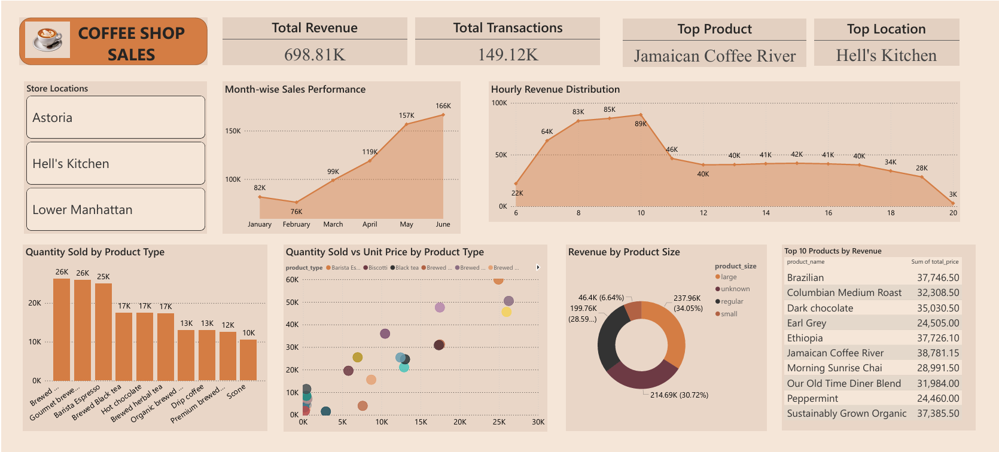

# ☕ Coffee Shop Sales Analysis Dashboard

An interactive sales analysis dashboard built using **Excel, Power Query, and Power BI** to analyze coffee shop transaction data, identify sales trends, customer behavior, and business growth opportunities.

---

## 📌 Project Overview

This project analyzes over **149K transactions** from January to June to uncover:

- Revenue growth trends
- Peak business hours
- Product performance
- Customer purchasing patterns
- Operational improvement opportunities

The dashboard transforms raw sales data into actionable business insights for better decision-making.

---

## 🛠 Tools Used

- **Microsoft Excel** – Data handling & preprocessing
- **Power Query** – Data cleaning & transformation
- **Power BI** – Dashboard development & visualization

---

## 📊 Dashboard Preview

---

## 📈 Key Insights

### 💰 Revenue Performance
- Generated **$698.81K total revenue**
- Processed **149.12K transactions**
- Highest revenue recorded in **May ($157K)**

### ☀ Peak Sales Hours
- Sales peak between **7 AM – 10 AM**
- Highest hourly revenue at **10 AM ($89K)**

### ☕ Product Insights
- **Regular size** products contributed the highest revenue share (**34.05%**)
- Top-selling categories:
  - Brewed Coffee
  - Gourmet Brewed Coffee
  - Barista Espresso

### 🏆 Top Revenue Product
- **Jamaican Coffee River**
  - Generated **$38,781.15** revenue

---

## 💡 Business Recommendations

- Optimize staffing during morning rush hours
- Introduce afternoon combo offers
- Improve upselling from Regular to Large sizes
- Re-evaluate evening operational hours

---

## 📚 Skills Demonstrated

- Data Cleaning
- Data Transformation
- Power BI Dashboarding
- Data Visualization
- KPI Reporting
- Business Analysis
- Exploratory Data Analysis (EDA)

---

## 🚀 Conclusion

This project demonstrates how business data can be transformed into meaningful insights using Power BI and Power Query, helping businesses improve operations, sales performance, and customer experience.

---

⭐ If you found this project useful, feel free to star the repository.
